# DCAVIA Padel

<div align="center">


---

### CI/CD Pipeline Status

| Pipeline | Status |
|----------|--------|
| 🧪 **Tests & Coverage** |  |
| 🏗️ **Build** |  |
| 🧹 **Code Quality** |  |
| 🔒 **Security Audit** |  |
| 📊 **Repo Stats** |  |

---

### Tech Stack


</div>

---

## About

DCAVIA Padel is a domain-centric application for managing padel court bookings, daily schedules, player accounts, and VIP reservations. The project is an assignment for the DCA1 course from VIA University College.

---

## Solution Architecture

```
DCAVIA_Padel.sln
│
├── 📦 src/Core/
│   ├── DCAVIA_Padel.Core.Domain                          # Aggregates, Entities, Value Objects
│   └── Tools/
│       └── DCAVIA_Padel.Core.Tools.OperationResult       # Result pattern & typed error hierarchy
│
└── 🧪 Tests/
    ├── UnitTests                                          # xUnit domain logic tests
    └── TestUtils                                          # Shared test data & helpers
```

## Domain Aggregates

```mermaid
graph TB
    subgraph DailySchedule Aggregate
        DS[🏟️ DailySchedule]
        CT[CourtType]
        DS --> CT
    end

    subgraph Player Aggregate
        P[👤 Player]
        E[Email]
        VID[VIAID]
        P --> E
        P --> VID
    end

    subgraph Booking Aggregate
        B[📋 Booking]
        D[Duration]
        B --> D
    end

    subgraph ReservationQueue Aggregate
        RQ[📬 ReservationQueue]
    end

    B -.->|references| P
    B -.->|references| DS
    RQ -.->|references| B
```



## Error Hierarchy


## CI/CD Pipelines

This project runs **5 automated pipelines** on every push:

| Pipeline | What it does | Trigger |
|----------|-------------|---------|
| **🧪 Tests & Coverage** | Runs all xUnit tests, generates code coverage with Cobertura, publishes test results as check annotations, posts coverage summary as PR comment | Push & PR |
| **🏗️ Build** | Compiles Debug (with warnings-as-errors) and Release configurations | Push & PR |
| **🧹 Code Quality** | Runs `dotnet format --verify-no-changes` and builds with `EnforceCodeStyleInBuild` | Push & PR |
| **🔒 Security Audit** | Scans all NuGet dependencies for known vulnerabilities (also runs weekly on Monday) | Push, PR & Scheduled |
| **📊 Repo Stats** | Counts lines of code across all projects with `cloc` | Push to main |

## Getting Started

```bash
# Clone
git clone https://github.com/mixs1234/DCAVIA_Padel.git

# Restore & Build
dotnet restore DCAVIA_Padel.sln
dotnet build DCAVIA_Padel.sln

# Run all tests
dotnet test DCAVIA_Padel.sln

# Run tests with coverage
dotnet test DCAVIA_Padel.sln --collect:"XPlat Code Coverage"
```

---

<div align="center">

*Built with frustration, caffeine, and Domain-Driven Design*


</div>